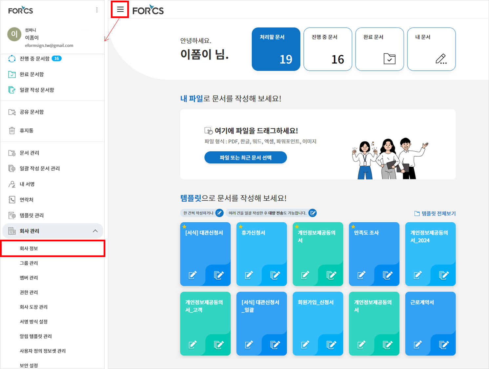

======================================
eformsign 기능 직접 삽입하기
======================================

eformsign 기능을 직접 삽입해 연계하게 되면, 고객이 제공하고 있는 서비스(혹은 사이트) 내에서 고객사의 사용자(최종 사용자)가 eformsign 서비스 사이트를 통하지 않고 고객의 서비스를 통해 자연스럽게 eformsign 전자문서를 사용할 수 있습니다.
예로 들면, 내 블로그에서 특정 YouTube 동영상을 소개하려고 할 때, 블로그에서 YouTube 동영상을 직접 삽입함으로써 해당 동영상을 블로그 내에서 바로 플레이할 수 있도록 하는 방식과 유사합니다.

-------------
준비하기
-------------

eformsign embedding 기능을 사용하기 위해서는 회사 ID, 템플릿 ID가 필요합니다.

회사 ID 확인 방법
========================

회사 관리 > 회사 정보 > 기본 정보에서 회사 ID를 확인할 수 있습니다.

eformsign 메뉴 들어가기
-------------------------

eformsign 회사정보 메뉴
--------------------------

회사 정보 > 기본 정보
-------------------------

.. image:: resources/companyinfo_companyid.png
    :alt: 회사 정보 > 기본 정보
    :width: 700px

템플릿 ID 확인 방법
=======================

템플릿 관리 메뉴로 이동하여 사용하려는 템플릿의 설정아이콘을 클릭하면 해당 템플릿의 URL에서 form_id를 확인할 수 있습니다. 

eformsign 템플릿 관리 메뉴
------------------------------

.. image:: resources/sidemenu_managetemplate.png
    :alt: eformsign 메뉴-템플릿 관리
    :width: 700px

eformsign 템플릿 관리 화면
---------------------------------

템플릿 ID 위치
-----------------------

.. image:: resources/templateURL_templateID.png
    :alt: 템플릿 ID 위치
    :width: 700px

---------------
설치하기
---------------

eformsign의 기능을 사용하고자 하는 웹 페이지에 다음의 스크립트를 추가합니다.

.. code-block:: javascript

   //jquery
   <script src="https://www.eformsign.com/plugins/jquery/jquery.min.js"/>
   //eformsign embedded script
   <script src="https://www.eformsign.com/lib/js/efs_embedded_v2.js"/>
   //eformsign redirect script
   <script src="https://www.eformsign.com/lib/js/efs_redirect_v2.js"/>

.. note::

   eformsign 기능을 삽입하고자 하는 페이지에 이 스크립트를 추가하면 eformsign 객체를 전역변수로 사용할 수 있습니다.

--------------------------
eformsign 객체에 대한 설명
--------------------------

eformsign 객체는 embedding과 redirect의 두 가지 타입으로 구성되어 있습니다.

+----------+-----------------------+--------------------------------------+
| Type     | Name                  | 설명                                 |
+==========+=======================+======================================+
| embedding| eformsign.document    | eformsign을 삽입해 문서를 작성할 수  |
|          | (document_option,     | 있도록 해주는 함수                   |
|          | iframe_id,            |                                      |
|          | success_callback,     | callback 파라미터는 옵션             |
|          | error_callback)       |                                      |
|          |                       | -  document_option, iframe_id: 필수  |
|          |                       |                                      |
|          |                       | -  success_callback: 옵션            |
|          |                       |                                      |
|          |                       | -  error_callback: 옵션              |
+----------+-----------------------+--------------------------------------+
| redirect | eformsign.document    | eformsign으로의 페이지 전환 방식으로 |
|          | (document_option)     | 문서를 작성할 수 있도록 해주는 함수  |
|          |                       |                                      |
|          |                       | -  document_option : 필수            |
+----------+-----------------------+--------------------------------------+

1. EformSignDocument.document 함수
==============================================

.. note::

   함수 형태
   document(document_option, iframe_id, success_callback , error_callback)

eformsign을 임베딩하여 고객사의 사이트/서비스에서 문서를 작성, 처리, 미리보기 할 수 있습니다.
EformSignDocument.document 함수는 임베딩할 문서의 상세 옵션을 설정하는 함수입니다.

document_option과 callback의 2가지 파라미터를 사용할 수 있습니다.

===================  ===============  ==========  ==========================================================
 Parameter Name       Parameter Type   필수여부      설명 
===================  ===============  ==========  ==========================================================
 document_option      Json             필수         eformsign을 임베딩하여 구동할 회사, 사용자, 문서 등의 옵션을 지정 
 iframe_id            String           필수         eformsign이 임베딩되어 표시될 iframe id 
 success_callback     Function         비필수       eformsign 문서 작성 성공 시, 호출될 callback 함수
 error_callback       Function         비필수       eformsign 문서 작성 실패 시, 호출될 callback 함수 
===================  ===============  ==========  ==========================================================

.. code-block:: javascript

    var eformsign = new EformSignDocument();
 
    var document_option = {
       "company" : {
          "id" : "",            // Company ID 입력
          "country_code" : "",  // 국가 코드 입력 (ex: kr)
          "user_key": ""        // 임베딩한 고객 측 시스템에 로그인한 사용자의 unique key. 브라우저 쿠키의 이폼사인 로그인 정보와 비교
       },
       "user" : {
            "type" : "01" ,         // 사용자 구분 (01: 멤버, 02: 외부자)
            "id": "test1@forcs.com" // 사용자 ID(이메일)
            "access_token" : "",    // Access Token 입력 (OpenAPI Access Token 참조)
            "refresh_token" : "",   // Refresh Token 입력 (OpenAPI Access Token 참조)
            "external_token" : "",  // 외부자 처리 시 사용자를 인증할 External Token 입력 (Webhook에서 제공)
            "external_user_info" : {
               "name" : ""          // 외부자 처리 시 외부자 이름 입력
            }
        },
        "mode" : {
            "type" : "02",      // 모드 (01: 새 문서 작성, 02: 문서 처리, 03: 문서 미리보기)
            "template_id" : "", // template id 입력
            "document_id" : ""  // document_id 입력
        },
        "layout" : {
            "lang_code" : "ko" // 이폼사인 언어. ko, en, ja
        },
        "prefill" : {
            "document_name": "", // 문서 제목 입력
            "fields": [
                {
                    "id" ; "고객명",       // 필드명
                    "value" : "홍길동",    // 필드값
                    "enabled" : true,   // 활성화 여부
                    "required" : true   // 필수 여부
                }
            ],
            "recipients": [
                {
                    "step_idx" : "2",       // 워크플로우 순서. 수신자가 있을 경우 2부터 시작
                    "step_type": "06",      // 단계 종류. 05: 참여자, 06: 검토자
                    "name" : '김테스트',        // 수신자 이름
                    "id": "test@forcs.com", // 수신자 ID/이메일
                    "sms": "01023456789",   // 수신자 핸드폰 번호
                    "use_mail": true,       // 이메일 알림 사용 여부
                    "use_sms": true,        // SMS 알림 사용 여부
                    "auth": {
                        "password": "",     // 워크플로우 설정에서 문서 열람 전 본인확인 설정 - 본인확인 정보에 체크한 경우 비밀번호 입력
                        "password_hint": "",// 위 조건에 따라 비밀번호를 입력한 경우, 비밀번호 힌트
                        "valid": {
                            "day": 7,       // 문서 전송 기한 (일)
                            "hour": 0       // 문서 전송 기한 (시간)
                        }
                    }
                }
            ],
            "comment": "여기에 코멘트 입력"     // 메시지
        },
        "return_fields" : ['고객명']           // Success Callback에서 값을 확인할 수 있도록 넘겨줄 필드명
    };
     
    //callback option
    var success_callback = function(response){ 
        console.log(response.code); 
        if( response.code == "-1"){
            //문서 작성 성공
            console.log(response.document_id);
            // return_fields에 넘긴 데이터를 조회 가능함. fields는 폼을 작성할 때 만든 입력 컴포넌트의 id를 의미함.
            console.log(response.field_values["company_name"]);
            console.log(response.field_values["position"]);
        }
    };
     
    var error_callback = function(response){
        console.log(response.code); 
        //문서 작성 실패
        alert(response.message);
    };
     
    eformsign.document(document_option, "eformsign_iframe", success_callback, error_callback);

2.  EformSignDocument.open 함수
=============================================

문서 임베딩을 시작하는 함수입니다.

EformSignDocument.document 함수로 문서 옵션을 우선 설정한 후 EformSignDocument.open을 실행하시기 바랍니다.

.. code-block:: javascript

    var eformsign = new EformSignDocument();
    //중략
    eformsign.document(document_option, "eformsign_iframe", success_callback, error_callback, action_callback);
    eformsign.open();

+++++++++++++++++++++++++++++++++++++++++++++++++++++++++++++++++++++++++++++++++++++++++++++++++++++++++++++++++++

-------------------------------
document-option 파라미터
-------------------------------

document-option에서는 다음 6가지 항목을 설정할 수 있습니다. 

===============  =============  ============  =====  ================================================================================
 변수명           설명           데이터 타입   필수    하위 옵션 
===============  =============  ============  =====  ================================================================================
 company          회사 정보       Object        O      id, country_code, user_key
 mode             임베딩 모드     Object        O      type, template_id, document_id
 user             사용자 정보     Object        X      type, id, access_token, refresh_token, external_token, external_user_info
 layout           레이아웃        Object        X      lang_code
 prefill          자동 기입       Object        X      document_name, fields, recipients, comment
 return_fields    리턴 필드       Array         X     
===============  =============  ============  =====  ================================================================================

.. note::

   회사 정보와 모드는 필수 입력정보입니다. 

1. company(회사 정보/필수)
========================================

===============  ==========================  =============  =======  =================================================================================================================
 변수명           설명                        데이터 타입     필수      비고 
===============  ==========================  =============  =======  =================================================================================================================
 id               회사 ID                      String          O      회사 관리 - 회사 정보에서 확인

 country_code     국가 코드                    String          X      회사 관리 - 회사 정보의 국가에 대한 코드를 지정. 비필수이나, 입력 시 빠른 open이 가능함

 user_key         고객시스템 사용자 고유 키     String          X    임베딩하는 고객사의 시스템에서 해당 유저가 누구인지를 명확히 설정하기 위해 eformsign에 넘겨주는 사용자 계정 정보임

                                                                     브라우저에 이미 로그인 정보가 있을 경우, 해당 key와 비교하여 일치하지 않는 경우 로그아웃 처리됨

===============  ==========================  =============  =======  =================================================================================================================

.. code-block:: javascript

   var document_option = {
         "company" : {
             "id" : 'f9aec832efef4133a1e849efaf8a9aed',
             "country_code" : "kr",
             "user_key": "eformsign@forcs.com"
         }
    };

2. mode(임베딩 모드/필수)
========================================

===============  ===============  ===========  =====  ==================================================
 변수명           설명            데이터 타입   필수    비고 
===============  ===============  ===========  =====  ==================================================
 type             기능 타입        String        O      01: 문서 작성, 02: 문서 처리, 03: 미리 보기
 template_id      템플릿 ID        String        X      
 document_id      문서 ID          String        X      문서 처리, 미리 보기 시 필수
===============  ===============  ===========  =====  ==================================================

**템플릿을 이용한 신규 작성** 

- 템플릿을 이용하여 문서를 새로 작성합니다.

.. code-block:: javascript

    var document_option = {
       "mode" : {
        "type" : "01" ,  // 01 : 문서 작성 , 02 : 문서 처리 , 03 : 미리 보기
        "template_id" : "a2c6ed9df9b642f2ade43c7efe58c9a3" // template id 입력
      }
    }

**수신한 문서를 이용한 추가 작성** 

- 수신한 문서를 이용하여 추가로 문서를 작성합니다.  

.. code-block:: javascript

    var document_option = {
       "mode" : {
        "type" : "02" ,  // 01 : 문서 작성 , 02 : 문서 처리 , 03 : 미리 보기
        "template_id" : "a2c6ed9df9b642f2ade43c7efe58c9a3", // template id 입력
        "document_id" : "5c19ff8c703f401c968236837d701e92"  // document_id 입력
      }
    }

**특정한 문서를 미리보기**

- 작성된 문서를 미리보기합니다.

.. code-block:: javascript

    var document_option = {
       "mode" : {
        "type" : "03" ,  // 01 : 문서 작성 , 02 : 문서 처리 , 03 : 미리 보기
        "template_id" : "a2c6ed9df9b642f2ade43c7efe58c9a3", // template id 입력
        "document_id" : "5c19ff8c703f401c968236837d701e92"  // document_id 입력
      }
    }

3. user(사용자 정보/비필수)
========================================

=========================  ===================  =============  =======  ==========================================================================
 변수명                     설명                 데이터 타입    필수     비고 
=========================  ===================  =============  =======  ==========================================================================
 type                       사용자 타입            String         O        01: 회사 멤버, 02: 외부 작성자
 id                         계정(이메일)           String         X        사용자 ID/이메일 입력
 access_token               Access Token           String         X        Open API > Access Token 발급 참조
 refresh_token              Refresh Token          String         X        Open API > Access Token 발급 참조
 external_token             외부자 처리용 토큰     String         X        멤버가 아닌 사용자가 수신한 문서 처리 시 필수 입력 (Webhook에서 제공)
 external_user_info         외부 작성자 정보       String         X        멤버가 아닌 사용자가 문서 작성 또는 처리 시 필수 입력
 external_user_info.name    외부 작성자 이름       String         X        멤버가 아닌 사용자가 문서 작성 또는 처리 시 필수 입력
=========================  ===================  =============  =======  ==========================================================================

**회사 내 멤버 로그인을 통한 작성 또는 처리**

- 유저 정보를 지정하지 않을 경우에 해당합니다.	
- 이 경우, eformsign 로그인 페이지가 구동되며 로그인 과정 이후에 문서를 작성할 수 있습니다.

**회사 내 멤버 로그인을 통한 작성 또는 처리 (ID 사전 입력)**   

- 임베딩 시, eformsign 로그인 페이지가 구동되어 로그인 과정 이후에 문서를 작성할 수 있습니다. 이때, ID가 로그인 화면에 미리 입력되어 있습니다.

.. code-block:: javascript

    var document_option = {
        "user":{
            "type" : "01",
            "access_token" : "eyJhbGciOiJSUzI1NiJ9.eyJpc3MiOiJlZ...",
            "refresh_token" : "0161ac6c-0f47-4cc3-9301-381f57c41495"
        }
    };

**회사 내 멤버의 토큰을 이용한 작성 또는 처리**	

- 임베딩 시, eformsign 로그인 과정없이, 특정 계정의 token을 이용하여 문서를 작성 및 수신한 문서를 작성합니다.
- 토큰 발급 방법은 Open API의 Access token 발급을 통해 가능합니다.

.. code-block:: javascript

    var document_option = {
        "user":{
            "type" : "01",
            "access_token" : "eyJhbGciOiJSUzI1NiJ9.eyJpc3MiOiJlZ...",
            "refresh_token" : "0161ac6c-0f47-4cc3-9301-381f57c41495"
        }
    };

**회사 내 멤버가 아닌 사용자가 신규 문서 작성**  

- eformsign의 회원이 아닌 사용자가 문서를 작성할 수 있도록 하는 방식입니다.

.. code-block:: javascript

    var document_option = {
        "user":{
            "type" : "02",
            "external_user_info" : {
               "name" : "홍길동"
            }
        }
    };

**회사 내 멤버가 아닌 사용자가 수신한 문서를 작성**

- 임베딩 시, eformsign의 회원이 아닌 사용자가 수신한 문서를 작성할 수 있도록 하는 방식입니다.

.. code-block:: javascript 

    var document_option = {
        "user":{
            "type" : "02",
            "external_token" : "f8e2ff29114445dcac1e2889ac2f8a5e",
            "external_user_info" : {
                "name" : "홍길동"
            }
        }
    };

4. layout(레이아웃/비필수)
========================================

===============  ===============  ===========  =====  ==================================================
 변수명           설명            데이터 타입   필수    비고 
===============  ===============  ===========  =====  ==================================================
 lang_code        eformsign 언어   String        X     ko: 한국어, en: 영어, ja: 일본어
===============  ===============  ===========  =====  ==================================================

.. code-block:: javascript

    var document_option = {
        "layout" : {
              "lang_code" : "ko"
        }
    }

5. prefill(자동 기입/비필수)
========================================

문서 작성 과정 중에 자동으로 입력될 수 있도록 처리 시 사용합니다.

=================================  ==============================  ============  ======  ======================================================================================
 변수명                             설명                            데이터 타입    필수     비고 
=================================  ==============================  ============  ======  ======================================================================================
document_name                      문서 제목                       String         X   
fields                             필드 목록                       Array          X       필드 설정 Object의 목록
fields[].id                        필드명                          String         X       필드 설정 Object 내에서는 필수 (필드명을 기준으로 설정 적용)
fields[].value                     필드값                          String         X       - 지정하지 않을 경우, 신규 작성의 경우 템플릿 설정의 필드 설정 옵션을 따름
                                                                                          - 설정할 경우, 템플릿 설정의 필드 설정 보다 우선 순위 높음
fields[].enabled                   필드 활성화 여부                 Boolean        X      - 지정하지 않을 경우, 템플릿 설정의 항목 제어 옵션에 따름
                                                                                          - 설정할 경우, 템플릿 설정의 항목 제어 옵션보다 우선 순위 높음
fields[].required                  필드 필수 여부                   Boolean        X      - 지정하지 않을 경우, 템플릿 설정의 항목 제어 옵션에 따름
                                                                                          - 설정할 경우, 템플릿 설정의 항목 제어 옵션보다 우선 순위 높음
recipients                         수신자 목록                      Array          X        수신자 정보 Object의 목록
recipients[].step_idx              워크플로우 순서                  String         X        첫 번째 수신자: "2", 두 번째 이후 수신자: 순서에 따라 1씩 증가

recipients[].step_type             수신자 종류                      String         X      - 기존 워크플로우: "01"(완료), "02"(결재), "03"(외부 수신자), "04"(내부 수신자)

                                                                                          - 신규 워크플로우: "01"(완료), "05"(참여자), "06"(검토자)

                                                                                          recipients 내 각 객체에 필수 설정되어야 함

recipients[].name                  수신자 이름                      String         X 
recipients[].id                    계정(이메일)                     String         X       - 회사 멤버의 계정 정보 (ID/이메일) 입력
                                                                                           - step_type이 05(참여자) 혹은 06(검토자)인 경우, 멤버 여부 관계 없이 이메일 주소 입력 가능
recipients[].sms                   휴대폰 번호                      String         X   
recipients[].use_mail              이메일 발송 여부                 Boolean        X   
recipients[].use_sms               SMS 발송 여부                    Boolean        X   
recipients[].auth                  본인 확인 및                     Object         X   
                                    문서 전송 기한 정보
recipients[].auth.password         본인 확인 정보 (비밀번호)         String         X        워크플로우 설정에서 문서 열람 전 본인확인 설정 - 본인확인 정보에 체크한 경우 비밀번호 입력
recipients[].auth.password_hint    본인 확인 정보 도움말             String         X        위 조건에 따라 비밀번호를 입력한 경우, 비밀번호 힌트
                                   (비밀번호 힌트)
recipients[].auth.valid            문서 전송 기한 정보              Object          X        미 입력시 기본값: 0일 0시간 (멤버의 경우 무제한, 외부 수신자의 경우 화면 상에서 재입력 필요)
recipients[].auth.valid.day        문서 전송 기한 (일)              Integer         X   
recipients[].auth.valid.hour       문서 전송 기한 (시간)            Integer         X   
comment                            다음 수신자에게 전달할 메시지     String          X   
=================================  ==============================  ============  ======  ======================================================================================

.. code-block:: javascript

    var document_option = {
        "prefill" : {
            "document_name": "개인정보활용동의서",   // 문서 제목 입력
            "fields": [
                {
                    "id" ; "고객명",       // 필드명
                    "value" : "홍길동",    // 필드값
                    "enabled" : true,   // 활성화 여부
                    "required" : true   // 필수 여부
                }
            ],
            "recipients": [
                {
                    "step_idx" : "2",       // 워크플로우 순서. 수신자가 있을 경우 2부터 시작
                    "step_type": "06",      // 단계 종류. 05: 참여자, 06: 검토자
                    "name" : "홍길동",        // 수신자 이름
                    "id": "test@forcs.com", // 수신자 ID/이메일
                    "sms": "01023456789",   // 수신자 핸드폰 번호
                    "use_mail": true,       // 이메일 알림 사용 여부
                    "use_sms": true,        // SMS 알림 사용 여부
                    "auth": {
                        "password": "6789", // 워크플로우 설정에서 문서 열람 전 본인확인 설정 - 본인확인 정보에 체크한 경우 비밀번호 입력
                        "password_hint": "핸드폰 뒷자리를 입력하세요.", // 위 조건에 따라 비밀번호를 입력한 경우, 비밀번호 힌트
                        "valid": {
                            "day": 7,       // 문서 전송 기한 (일)
                            "hour": 0       // 문서 전송 기한 (시간)
                        }
                    }
                }
            ],
            "comment": "확인 및 서명 바랍니다."  // 메시지
        }
    };

6. 리턴 필드(비필수)
========================================

문서 작성 및 수정 후, 사용자가 작성한 필드의 내용 중 callback 함수를 통해 받을 수 있는 항목을 지정합니다.
    
.. note::

   미 지정시 기본 필드만 제공합니다. 관련 내용은 CallBack 파라미터를 참고하세요.

.. code-block:: javascript

    var document_option = {
       "return_fields" : ['고객명']
    }

-------------------------------
Callback 파라미터
-------------------------------

1. response
========================================

문서 작성/처리를 성공 혹은 실패 시 다음과 같은 구조로 response가 반환됩니다.

=================================  =================  ===================================================  ===========================================================
 변수명                              타입               설명                                                  비고 
=================================  =================  ===================================================  ===========================================================
type                                String             임베딩하여 작성한 작업의 종류                       - document

                                                                                                           - 이외 기능은 추후 제공 예정

fn                                  String             수행한 기능                                         - saveSuccess : 저장 성공

                                                                                                           - 그 외 : 오류

code                                String             문서 작성 혹은 처리 시 결과 코드를 반환             - -1 : 문서 작성/처리 성공

                                                                                                           - 0 : 로그아웃 성공

                                                                                                           - 그 외: 오류

message                             String                                                                 - 문서 작성 혹은 처리 시 성공/오류 메시지를 반환 
                                                                                                           - '성공하였습니다.' : 문서 작성/처리 성공
                                                                                                           - 그 외: 오류

document_id                         String             문서 제출 성공시, 작성한 문서의 document_id 반환       ex) '910b8a965f9402b82152f48c6da5a5c'

title                               String             문서 제출 성공시, 작성한 문서의 제목을 반환             ex) '계약서''

values                              Object             document_option에 정의한 return_fields에             {'필드명': '필드값'} 형태의 Object로 제공

                                                       입력한 필드명에 대해 사용자가 입력한 값을 반환       ex) {'성함': '홍길동'}

recipients                          Array               다음 수신자 정보 Object 목록을 반환 
recipients[].step_idx               String              워크플로우 순서                                      첫 번째 수신자: '2', 두 번째 이후 수신자: 순서에 따라 1씩 증가

recipients[].step_type              String              수신자 종류                                         기존 워크플로우: '01'(완료), '02'(결재), '03'(외부 수신자), '04'(내부 수신자)

                                                                                                            신규 워크플로우: '01'(완료), '05'(참여자), '06'(검토자)

recipients[].recipient_type         String              수신자 유형                                         '01' : 회사 멤버

                                                                                                            '02' : 외부 수신자

recipients[].use_mail               Boolean             이메일 발송 여부   
recipients[].use_sms                Boolean             SMS 발송 여부   
recipients[].id                     String              계정(이메일) 
recipients[].name                   String              수신자 이름  
recipients[].sms                    String              휴대폰 번호  
recipients[].auth                   Object              본인 확인 및 문서 전송 기한 정보 
recipients[].auth.password          String              본인 확인 정보 (비밀번호) 
recipients[].auth.password_hint     String              본인 확인 정보 도움말 (비밀번호 힌트)  
recipients[].auth.valid             Object              문서 전송 기한 정보 
recipients[].auth.valid.day         Integer             문서 전송 기한 (일)    
recipients[].auth.valid.hour        Integer             문서 전송 기한 (시간)   
=================================  =================  ===================================================  ===========================================================

.. code-block:: javascript

    {
      "type": "document",
      "fn": "saveSuccess",
      "code": "-1",
      "message": "성공하였습니다.",
      "document_id": "c59c522ea9294660bfa84263c95c4e54",
      "title": "개인정보활용동의서",
      "values": {
        "성함": "홍길동"
      },
      "recipients": [
        {
          "step_idx": 2,
          "step_type": "06",
          "recipient_type": "02",
          "use_mail": true,
          "use_sms": true,
          "id": "test@forcs.com",
          "name": "홍길동",
          "sms": "+821023456789",
          "auth": {
            "password": "",
            "password_hint": "",
            "valid": {
              "day": 7,
              "hour": 0
            }
          }
        }
      ]
    }

2. callback
========================================

문서 작성/처리 성공 혹은 실패 시 반환되는 response를 받아서 원하는 작업을 하도록 success_callback과 error_callback 함수를 작성할 수 있습니다.

필요에 따라 콘솔에 출력하거나 (console.log) 경고창을 표출할 수 있으며(alert), 조건문 등을 이용해 원하는 상황에 원하는 기능을 수행하도록 할 수 있습니다.

.. code-block:: javascript

    var eformsign = new EformSignDocument();
     
    var document_option = { /* 생략 */ };
     
    var success_callback= function(response){
        console.log(response.document_id);
        console.log(response.title);
        console.log(response.values["성함"]);
    };
     
    var error_callback= function(response){
        alert(response.message);
        console.log(response.code); 
        console.log(response.message);
    };
     
    eformsign.document(document_option, "eformsign_iframe", success_callback, error_callback);
