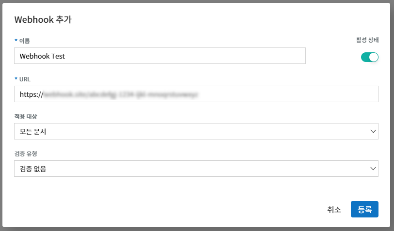
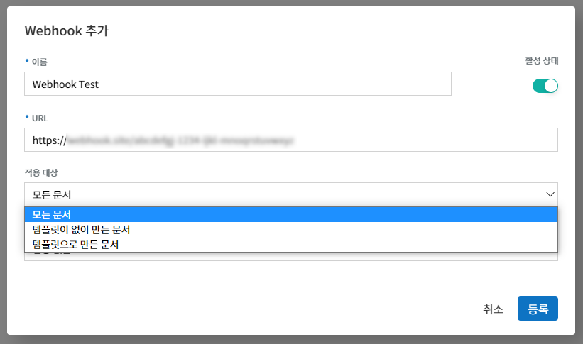
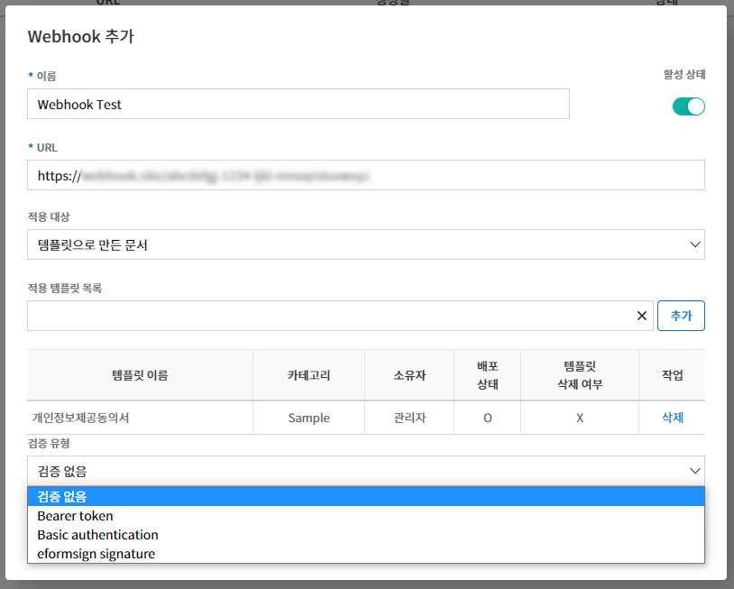
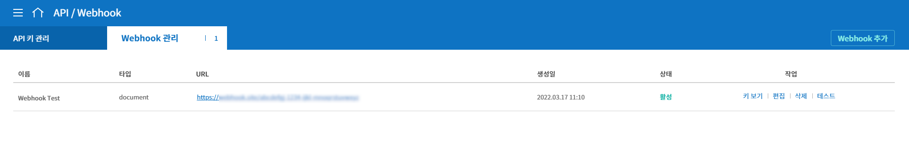
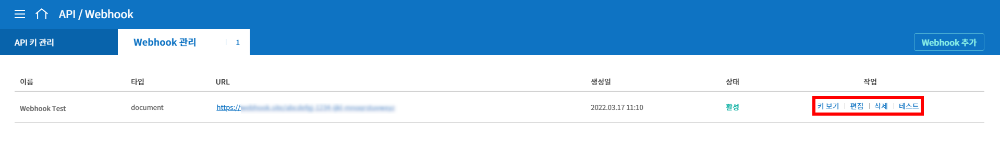
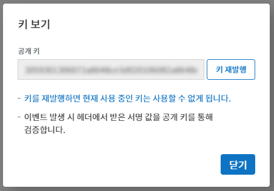
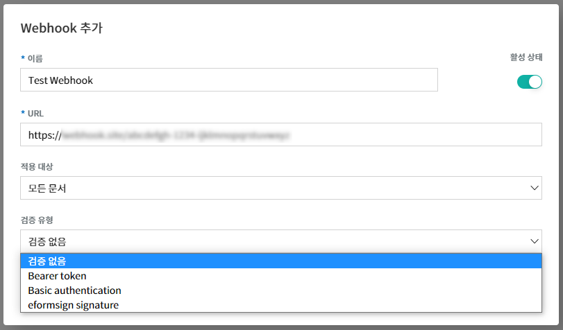
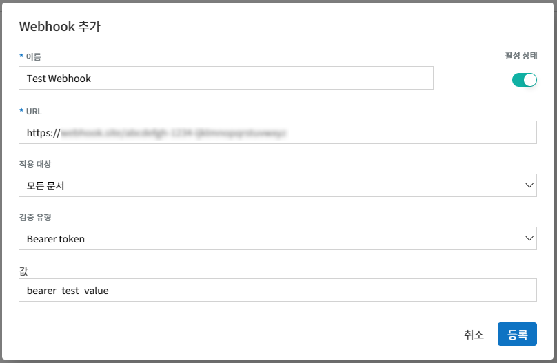
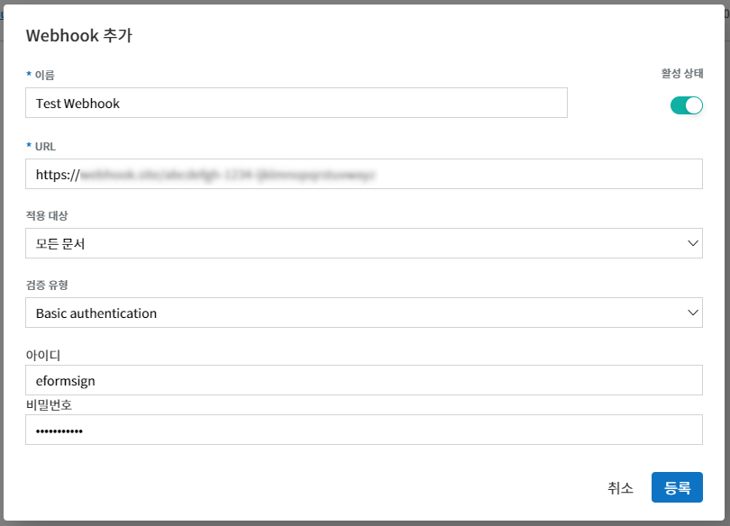

.. _webhook:

----------------------------
eformsign Webhook 사용하기
----------------------------

eformsign에 이벤트가 발생했을 때 발생한 이벤트의 정보를 고객 시스템/서비스로 알려주는 기능입니다. Webhook을 설정하면, 고객의 Webhook endpoint로 해당 이벤트 정보를 HTTP POST형식으로 알려줍니다.

.. tip:: 

   Webhook의 endpoint는 고객의 client callback URL을 뜻합니다. Open API를 지속적으로 호출하여 변경사항을 체크하는 방법(polling)과 비교하여 불필요한 호출 없이 eformsign 상의 이벤트에 대한 정보를 얻을 수 있습니다.

시작하기 
=========

.. _addwebhook:

Webhook 추가하기
--------------------

1. eformsign에 대표 관리자로 로그인 후, 메뉴에서 **[커넥트] > [API / Webhook]** 페이지로 이동합니다. 

.. image:: resources/apikey1.PNG
    :width: 700
    :alt: 커넥트 > API/Webhook 메뉴 위치

2. **[Webhook 관리]** 탭을 선택하고 **Webhook 추가** 버튼을 클릭합니다.

.. image:: resources/webhook2.PNG
    :width: 700
    :alt: Webhook 추가 버튼

3. Webhook 추가 팝업창에 이름, Webhook을 수신할 URL(Endpoint URL), 활성 상태를 선택합니다.

4. **적용 대상**\ 을 선택합니다. 적용 대상은 **모든 문서, 템플릿이 없이 만든 문서, 템플릿으로 만든 문서** 중에 선택할 수 있습니다.

- **모든 문서:** 해당 회사에서 생성된 모든 문서에 대해 Webhook이 발송됩니다.
- **템플릿이 없이 만든 문서:** **내 파일로 문서 작성**\ 으로 템플릿 없이 생성한 문서에 대해 Webhook이 발송됩니다.
- **템플릿으로 만든 문서:** 선택한 템플릿으로 생성된 문서에 대해 Webhook이 발송됩니다.

.. note::

   템플릿 선택은 다음과 같은 절차를 통해 수행하실 수 있습니다.

   ① **적용 템플릿 목록** 선택창을 클릭하면 템플릿 목록이 표시됩니다. 목록에서 추가하고자 하는 템플릿을 선택합니다. 이 때, 템플릿(|image1|)을 선택해야 합니다. 카테고리(|image2|)를 선택하면 적용 템플릿 목록에 추가되지 않습니다.

    .. image:: resources/Webhook_select_template.png
        :width: 500
        :alt: Webhook 키 생성 팝업창 3

   ② 추가하고자 하는 템플릿을 선택 후, 우측의 **추가** 버튼을 클릭합니다.

    .. image:: resources/Webhook_add_popup.png
        :width: 500
        :alt: Webhook 키 생성 팝업창 4

   ③ **적용 템플릿 목록**\ 에 선택한 템플릿이 추가 된 것을 확인할 수 있습니다. 이 절차를 반복하여, 여러 템플릿을 추가할 수도 있습니다.

    .. image:: resources/Webhook_add_popup2.png
        :width: 500
        :alt: Webhook 키 생성 팝업창 5   

5. **검증 유형**\ 을 선택합니다. 검증 유형은 **검증 없음, Bearer token, Basic authentication, eformsign signature** 중에서 선택할 수 있습니다. 각 검증 유형에 대한 설명은 `Webhook 검증하기 <#webhookauth>`__\을 확인해 주세요.

6. **등록** 버튼을 클릭하면 Webhook이 추가됩니다. **Webhook 관리** 목록에서 추가한 Webhook을 확인할 수 있습니다.

Webhook 관리하기
--------------------

Webhook 목록에서 각 Webhook 우측의 작업 버튼을 통해 관리 작업을 수행할 수 있습니다. 

키 보기
~~~~~~~~~~~~~~~

검증 유형을 eformsign signature로 설정한 경우, Webhook 검증을 위해 필요한 공개 키를 확인할 수 있습니다.
**키 재발행** 버튼을 클릭해 키를 재발행할 수 있습니다. 키를 재발행 할 경우, 기존에 사용 중이던 키는 사용할 수 없게 됩니다.

검증 유형을 eformsign signature 이외의 다른 유형으로 설정한 경우, 빈 값이 표시됩니다.

편집
~~~~~~~~~~~~~~~
등록된 Webhook의 이름, URL, 활성 상태, 적용 대상, 검증 유형을 편집할 수 있습니다.

삭제
~~~~~~~~~~~~~~~
등록된 Webhook을 삭제할 수 있습니다.

테스트
~~~~~~~~~~~~~~~
설정한 Webhook URL로 테스트 Webhook을 전송하고, 결과를 반환합니다.

테스트 Webhook의 Body는 다음과 같습니다.
설정한 검증 유형에 따라, 헤더에 관련 정보가 포함되어 전송됩니다.

.. code:: JSON

    {
      "webhook_id": "해당 Webhook ID",
      "webhook_name": "해당 Webhook 이름",
      "company_id": "회사 ID",
      "event_type": "document",
      "document": {
        "id": "test_doc_id",
        "document_title": "test_document_title",
        "template_id": "test_template_id",
        "template_name": "test_template_name",
        "workflow_seq": 0,
        "template_version": "1",
        "history_id": "test_document_history_id",
        "status": "doc_create",
        "editor_id": "사용자 ID",
        "updated_date": "현재 시간(UTC Long)"
      }
    }

.. note::

   테스트 성공 여부에 따라 다음과 같이 팝업 메시지가 표시됩니다.

   **테스트 Webhook 전송 성공 시**

    .. image:: resources/webhook_success_popup.png
        :width: 400
        :alt: Webhook 전송 테스트 성공 시

   **테스트 Webhook 전송 실패 시**

    .. image:: resources/webhook_failed_popup.png
        :width: 400
        :alt: Webhook 전송 실패 시

   **테스트 Webhook 전송 오류 발생 또는 응답이 없을 시**

    .. image:: resources/webhook_error_popup.png
        :width: 400
        :alt: Webhook 오류 발생 시   

.. _webhookauth:

Webhook 검증하기 
========================

수신한 Webhook이 eformsign에서 호출한 정상적인 Webhook이 맞는지 검증할 수 있는 기능입니다. 

Webhook 추가 혹은 편집 시, 다음과 같이 검증 유형을 선택할 수 있습니다.

- **검증 없음**

검증을 위한 별도의 정보 없이 Webhook을 발송합니다. 이 경우에도 이벤트 정보는 확인할 수 있지만, 수신한 Webhook이 정상 Webhook인지 검증할 수 없습니다.

- **Bearer Token**

검증을 위해 사전 설정한 토큰 값을 이용하는 방식입니다. 
Webhook 추가 혹은 편집 시, 검증 유형을 **Bearer token**\ 으로 선택하고 토큰으로 사용할 값을 **값**\ 란에 입력합니다.
이와 같이 설정하면, Request Header의 Authorization 필드에 해당 값을 포함하여 Webhook을 전송하게 됩니다.

예를 들어 위와 같이 값을 bearer_test_value라고 입력한 경우, Webhook 수신 시 Header에서 다음과 같은 내용을 확인할 수 있습니다.

.. code:: JSON

    Authentication : Bearer bearer_test_value

이처럼 수신한 Webhook의 Header에서 Token 값을 추출한 후, 사전 설정한 값과 일치하는지 확인하는 방식으로 검증할 수 있습니다.

- **Basic Authentication**

검증을 위해 아이디와 비밀번호를 이용하는 방식입니다. 

Webhook 추가 혹은 편집 시, 검증 유형을 **Basic authentication**\ 으로 선택하고 인증용으로 사용할 아이디와 비밀번호를 입력합니다.

이와 같이 설정하면, Request Header의 Authorization 필드에 사전 설정한 아이디와 비밀번호가 **아이디:비밀번호** 형태로 Base64 인코딩 한 값을 포함하여 Webhook을 전송하게 됩니다.

예를 들어 위와 같이 아이디를 **eformsign**\ , 비밀번호를 **Webhook123!**\ 라고 입력한 경우, Webhook 수신 시 Header에서 다음과 같은 내용을 확인하실 수 있습니다.

.. code:: JSON

    Authentication : Basic ZWZvcm1zaWduOldlYmhvb2sxMjMh

위의 예시에서 Basic 뒤의 값을 Base64 디코딩 시 **eformsign:Webhook123!**\ 가 됩니다.

이처럼 수신한 Webhook의 Header에서 Basic 뒤의 값을 Base64 디코딩하여 아이디와 비밀번호를 추출하고, 사전 설정한 아이디 및 비밀번호와 일치하는지 확인하는 방식으로 검증할 수 있습니다.

- **eformsign Signature**

검증을 위해 eformsign Signature 서명값을 이용하는 방식입니다.

.. note:: 

   eformsign Signature는 비대칭 키 방식과 타원곡선 암호화(Elliptic curve cryptography)를 사용하는 서명 방식입니다. 서명 알고리즘은 SHA256withECDSA를 사용합니다.

Webhook 추가 혹은 편집 시, 검증 유형을 **eformsign signature**\ 로 설정하면 Request Header의 eformsign_signature 필드에 서명값을 포함하여 Webhook을 전송하게 됩니다. 

Header 내용의 예시는 다음과 같습니다.

.. code:: JSON

    eformsign_signature : 3045022100b9f1e0cdd21492cb5fa16dabff4c4402bf3efb9a9741a40a0d1c70aeda24bc8c02204a57ca1abab288e968a799e2fecbf18de9ab59c7c5814144b17f32553640a71a

서명 검증을 위한 샘플 코드
--------------------------

Webhook의 Header에서 eformsign_signature 값을 추출한 후, Webhook 목록에서 **키 보기**\ 버튼을 클릭하여 확인할 수 있는 Webhook 공개 키 및 수신한 Webhook의 Request Body 내용을 이용해 검증할 수 있습니다.

Java
~~~~~~~~~~~

아래 샘플 코드를 확인해 주세요.

Python
~~~~~~~~~~

키 포맷 처리용 라이브러리를 사용해야 합니다. 작업 전 다음 명령어를 통해 해당 라이브러리를 설치하세요.

.. code:: python

   pip install https://github.com/warner/python-ecdsa/archive/master.zip

PHP
~~~~~~~~~

다음 예제의 keycheck.inc.php, test.php 파일이 동일한 경로에 위치하도록 한 후에 진행해야 합니다.

각 언어별 예제
~~~~~~~~~~~~~~~~~

다음은 각 언어별 예제입니다.

.. code-tabs::

    .. code-tab:: java
        :title: java

        import java.io.*;
        import java.math.BigInteger;
        import java.security.*;
        import java.security.spec.X509EncodedKeySpec;
         
         
        /**
         *  request에서 header와 body를 읽습니다.
         *
         */
         
         
        //1. get eformsign signature
        //eformsignSignature는 request header에 담겨 있습니다.
        String eformsignSignature = request.getHeader("eformsign_signature");
         
         
        //2. get request body data
        // eformsign signature 검증을 위해 body의 데이터를 String으로 변환 합니다.
        String eformsignEventBody = null;
        StringBuilder stringBuilder = new StringBuilder();
        BufferedReader bufferedReader = null;
         
        try {
            InputStream inputStream = request.getInputStream();
            if (inputStream != null) {
                bufferedReader = new BufferedReader(new InputStreamReader(inputStream));
                char[] charBuffer = new char[128];
                int bytesRead = -1;
                while ((bytesRead = bufferedReader.read(charBuffer)) > 0) {
                    stringBuilder.append(charBuffer, 0, bytesRead);
                }
            }
         } catch (IOException ex) {
            throw ex;
         } finally {
            if (bufferedReader != null) {
                try {
                    bufferedReader.close();
                } catch (IOException ex) {
                    throw ex;
                }
            }
         }
        eformsignEventBody = stringBuilder.toString();
         
         
         
         
        //3. publicKey 세팅
        String publicKeyHex = "이 곳에 발급받은 공개 키를 입력하세요";
        KeyFactory publicKeyFact = KeyFactory.getInstance("EC");
        X509EncodedKeySpec x509KeySpec = new X509EncodedKeySpec(new BigInteger(publicKeyHex,16).toByteArray());
        PublicKey publicKey = publicKeyFact.generatePublic(x509KeySpec);
         
        //4. verify
        Signature signature = Signature.getInstance("SHA256withECDSA");
        signature.initVerify(publicKey);
        signature.update(eformsignEventBody.getBytes("UTF-8"));
        if(signature.verify(new BigInteger(eformsignSignature,16).toByteArray())){
            //verify success
            System.out.println("verify success");
            /*
             * 이곳에서 이벤트에 맞는 처리를 진행합니다.
             */
        }else{
            //verify fail
            System.out.println("verify fail");
        }

    .. code-tab:: python
        :title: Python 3.9.6

        import hashlib
        import binascii
         
        from ecdsa import VerifyingKey, BadSignatureError
        from ecdsa.util import sigencode_der, sigdecode_der
        from flask import request
         
         
        # request에서 header와 body를 읽습니다.
        # 1. get eformsign signature
        # eformsignSignature는 request header에 담겨 있습니다.
        eformsignSignature = request.headers['eformsign_signature']
         
         
        # 2. get request body data
        # eformsign signature 검증을 위해 body의 데이터를 String으로 변환 합니다.
        data = request.json
         
         
        # 3. publicKey 세팅
        publicKeyHex = "이 곳에 발급받은 공개 키를 입력하세요"
        publickey = VerifyingKey.from_der(binascii.unhexlify(publicKeyHex))
         
         
        # 4. verify
        try:
            if publickey.verify(eformsignSignature, data.encode('utf-8'), hashfunc=hashlib.sha256, sigdecode=sigdecode_der):
                print("verify success")
                # 이곳에 이벤트에 맞는 처리를 진행 합니다.
        except BadSignatureError:
            print("verify fail")

    .. code-tab:: php
        :title: PHP - keycheck.inc.php

        <?php
        namespace eformsignECDSA;
          
        class PublicKey
        {
          
            function __construct($str)
            {
                $pem_data = base64_encode(hex2bin($str));
                $offset = 0;
                $pem = "-----BEGIN PUBLIC KEY-----\n";
                while ($offset < strlen($pem_data)) {
                    $pem = $pem . substr($pem_data, $offset, 64) . "\n";
                    $offset = $offset + 64;
                }
                $pem = $pem . "-----END PUBLIC KEY-----\n";
                $this->openSslPublicKey = openssl_get_publickey($pem);
            }
        }
         
        function Verify($message, $signature, $publicKey)
        {
            return openssl_verify($message, $signature, $publicKey->openSslPublicKey, OPENSSL_ALGO_SHA256);
        }
        ?>

    .. code-tab:: php
        :title: PHP - test.php

        <?php
        require_once __DIR__ . '/keycheck.inc.php';
        use eformsignECDSA\PublicKey;
         
        define('PUBLIC_KEY', '이 곳에 발급 받은 공개 키를 입력해주세요.');
         
        /*
         *  request에서 header와 body를 읽습니다.
         *
         */
         
         
        //1. get eformsign signature
        //eformsignSignature는 request header에 담겨 있습니다.
        $eformsignSignature = $_SERVER['HTTP_eformsign_signature'];
         
         
        //2. get request body data
        // eformsign signature 검증을 위해 body의 데이터를 읽습니다.
        $eformsignEventBody = json_decode(file_get_contents('php://input'), true);
         
         
        //3. publicKey 세팅
        $publicKey = new PublicKey(PUBLIC_KEY);
         
         
        //4. verify
        $ret = - 1;
        $ret = eformsignECDSA\Verify(MESSAGE, $eformsignSignature, $publicKey);
          
        if ($ret == 1) {
            print 'verify success' . PHP_EOL;
            /*
             * 이곳에서 이벤트에 맞는 처리를 진행합니다.
             */
        } else {
            print 'verify fail' . PHP_EOL;
        }
          
        ?>

.. _webhookevent:

Webhook 이벤트
====================

Webhook을 설정하면 eformsign에서 특정 이벤트 발생 시 설정한 Webhook URL로 이벤트 정보를 수신할 수 있습니다.

현재 제공 중인 `Webhook <https://app.swaggerhub.com/apis/eformsign_api/eformsign_API_2.0/Webhook#/>`_\ 은 다음과 같습니다.

Webhook 이벤트 종류
--------------------

현재 eformsign에서는 **문서 이벤트**\ 와 **PDF 생성 이벤트**\ 에 대해 Webhook을 발송하고 있습니다.

- **문서 이벤트:**\ eformsign에서 문서의 생성 또는 상태 변경 시 발생하는 이벤트입니다. event_type이 document이고, document Object를 포함하고 있습니다.
- **PDF 생성 이벤트:**\ eformsign에서 문서의 PDF 파일이 생성될 때 발생하는 이벤트입니다. event_type이 ready_document_pdf이고, ready_document_pdf Object를 포함하고 있습니다.

Webhook 구조
------------------

Webhook 이벤트 발생 시 사용자가 설정한 Webhook URL로 Webhook이 발송됩니다.

발송되는 Webhook의 Request Body 구조는 다음과 같습니다.

.. table:: 

   =================== ====== ==================================== ===============================================
   Name                Type   설명                                  비고
   =================== ====== ==================================== ===============================================
   webhook_id          String 이벤트를 발생시킨 Webhook의 ID
   webhook_name        String 이벤트를 발생시킨 Webhook의 이름
   company_id          String 회사 ID
   event_type          String 발생한 Webhook 이벤트의 종류         - document: 문서 이벤트

                                                                   - ready_document_pdf: PDF 생성 이벤트

   document            Object 문서 이벤트의 상세 정보              문서 이벤트 발생 시에만 표시됨 
                                                                   (id, document_title, template_id, template_name, 
                                                                   workflow_seq, workflow_name, template_version, 
                                                                   history_id, status, editor_id, outside_token, 
                                                                   updated_date, mass_job_request_id 포함)

   ready_document_pdf  String 워크플로우 명칭                      PDF 생성 이벤트 발생 시에만 표시됨
                                                                   (document_id, document_title, workflow_seq, 
                                                                   workflow_name, template_id, template_name,
                                                                   template_version, document_status, 
                                                                   document_history_id, export_ready_list, 
                                                                   mass_job_request_id 포함)

   =================== ====== ==================================== ===============================================

.. note::

    eformsign Webhook의 자세한 구조 및 예시는 `eformsign Webhook <https://app.swaggerhub.com/apis/eformsign_api/eformsign_API_2.0/Webhook#/>`__\ 에서 확인하실 수 있습니다.

.. _status:

문서 상태 코드
------------------

Webhook의 Request Body에는 문서 상태를 나타내는 코드가 포함되어 있습니다.

문서 이벤트의 경우 document.status, PDF 생성 이벤트의 경우 ready_document_pdf.document_status에 문서 상태 코드가 기재됩니다.

각 코드의 의미는 다음과 같습니다.

.. table:: 

   ========================== ====================================
   Name                       설명
   ========================== ====================================
   doc_tempsave               초안(최초 작성자 문서 임시 저장 상태)  
   doc_create                 문서 작성   
   doc_request_participant    참여자 요청
   doc_accept_participant     참여자 승인
   doc_reject_participant     참여자 반려
   doc_request_reviewer       검토자 요청
   doc_accept_reviewer        검토자 승인
   doc_reject_reviewer        검토자 반려
   doc_reject_request         반려 요청
   doc_decline_cancel_request 반려 요청 거절
   doc_delete_request         삭제 요청   
   doc_decline_delete_request 삭제 요청 거절
   doc_cancel_request         요청 취소
   doc_deleted                문서 삭제
   doc_request_approval       결재 요청(구형 워크플로우)
   doc_accept_approval        결재 승인(구형 워크플로우)
   doc_reject_approval        결재 반려(구형 워크플로우)
   doc_request_external       외부자 요청(구형 워크플로우)
   doc_remind_external        외부자 재 요청(구형 워크플로우)
   doc_open_external          외부자 열람(구형 워크플로우)
   doc_accept_external        외부자 승인(구형 워크플로우)
   doc_reject_external        외부자 반려(구형 워크플로우)
   doc_request_internal       내부자 요청(구형 워크플로우)
   doc_accept_internal        내부자 승인(구형 워크플로우)
   doc_reject_internal        내부자 반려(구형 워크플로우)
   doc_tempsave_internal      내부자 임시 저장(구형 워크플로우)
   doc_complete               문서 완료
   ========================== ====================================

.. |image1| image:: resources/template_icon.png
.. |image2| image:: resources/category_icon.png

